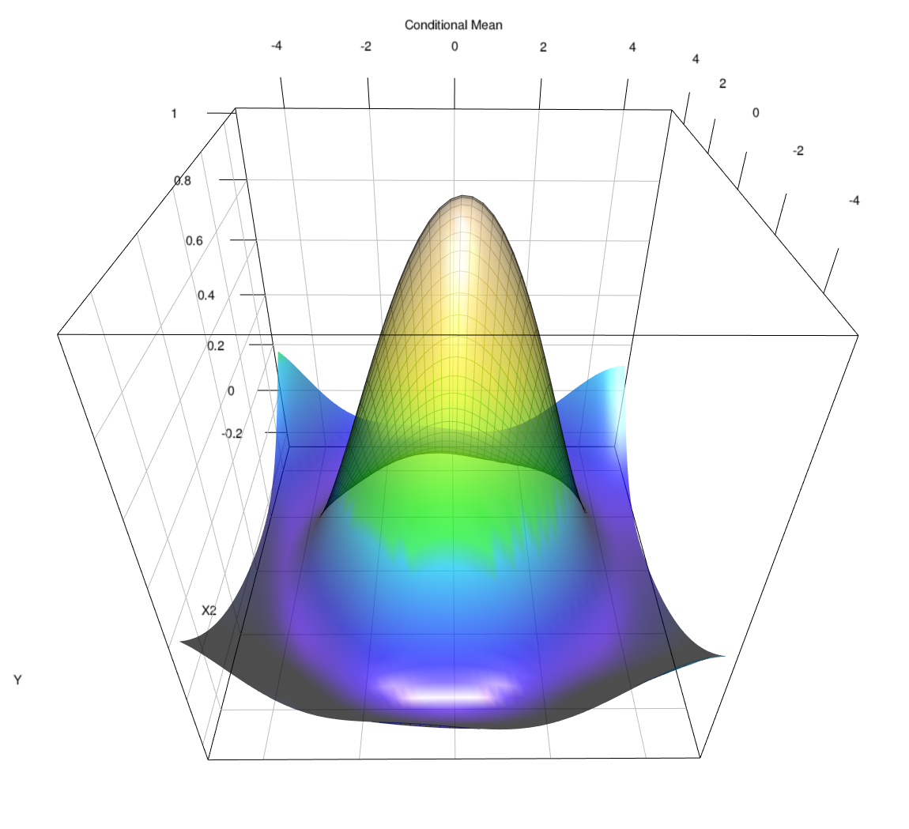

::: {.grid}
::: {.g-col-12 .g-col-lg-8}
::: {.hero-panel}
:::{.hero-kicker}
Field guide for nonparametric work in R
:::

# Gallery of code for `np`, `npRmpi`, and `crs` {.hero-title}

::: {.hero-deck}
This gallery is built to get you from “which package?” to working code quickly. Use it as a practical companion to the package manuals: choose the right tool, copy a small runnable example, and move to longer scripts only when you need them.
:::

::: {.hero-actions}
[Open Quickstarts](quickstarts.qmd){.hero-link .hero-link-primary}
[Choose a Package](primer.qmd){.hero-link .hero-link-secondary}
[Browse the Code Catalog](code_catalog.qmd){.hero-link .hero-link-secondary}
:::

::: {.package-strip}
::: {.package-chip .package-chip-np}
`np` for mixed-data kernels and core serial workflows
:::

::: {.package-chip .package-chip-mpi}
`npRmpi` when the same workflow needs MPI scale
:::

::: {.package-chip .package-chip-crs}
`crs` for spline and shape-constrained work
:::
:::
:::
:::

::: {.g-col-12 .g-col-lg-4}
::: {.hero-figure}
{.hero-image}

::: {.hero-caption}
A representative spline surface from the gallery archive. The site now treats figures like this as orientation and context, not as a reason to make users download code before they can learn.
:::
:::
:::
:::

::: {.quick-note}
This website is linked from my academic site and is meant to help people work, not just read. The default route is now: choose a package, copy a small script, then move into method notes, troubleshooting, and longer examples only as needed.
:::

:::{.section-label}
Start fast
:::

## Use the site by task { .section-heading }

::: {.grid}
::: {.g-col-12 .g-col-md-6}
::: {.home-card .card-start}
### [Choose a Package](primer.qmd)

Start here if you are deciding between `np`, `npRmpi`, and `crs`, or if you want the shortest route to the right tool.
:::
:::

::: {.g-col-12 .g-col-md-6}
::: {.home-card .card-start}
### [Install and Get Started](R_RStudio.qmd)

Short install notes, a minimal first run, and pointers for what to do next once the packages are installed.
:::
:::

::: {.g-col-12 .g-col-md-6}
::: {.home-card .card-start}
### [Quickstarts](quickstarts.qmd)

Small runnable scripts for `np`, `npRmpi`, and `crs`, shown inline so you can copy directly from the page.
:::
:::

::: {.g-col-12 .g-col-md-6}
::: {.home-card .card-support}
### [FAQ and Troubleshooting](faq.qmd)

Common questions, support routes, and links to the current canonical sources.
:::
:::
:::

:::{.section-label}
Method rooms
:::

## Learn by method and scale { .section-heading }

::: {.grid}
::: {.g-col-12 .g-col-md-6}
::: {.home-card .card-np}
### [Kernel Methods](np_npRmpi.qmd)

Core workflows for `np`, together with a clean route to `npRmpi` when jobs become larger or more time consuming.
:::
:::

::: {.g-col-12 .g-col-md-6}
::: {.home-card .card-mpi}
### [MPI and Large Data](mpi_large_data.qmd)

Updated guidance for `npRmpi`, with `session` mode now treated as the main interactive path rather than an afterthought.
:::
:::

::: {.g-col-12 .g-col-md-6}
::: {.home-card .card-crs}
### [Splines](crs.qmd)

Spline-focused entry page for `crs`, including constrained examples and a route into the spline primer.
:::
:::

::: {.g-col-12 .g-col-md-6}
::: {.home-card .card-np}
### [Kernel Primer](kernel_primer.qmd)

Short conceptual introduction to mixed-data kernels, bandwidth objects, and the basic `np` workflow.
:::
:::

::: {.g-col-12 .g-col-md-6}
::: {.home-card .card-np}
### [Density, Distribution, Quantiles](density_distribution_quantiles.qmd)

Route to `npudens`, `npudist`, `npcdens`, `npcdist`, and `npqreg` workflows.
:::
:::

::: {.g-col-12 .g-col-md-6}
::: {.home-card .card-np}
### [Semiparametric Models](semiparametric_models.qmd)

Partially linear, single-index, and varying-coefficient workflows in one place.
:::
:::

::: {.g-col-12 .g-col-md-6}
::: {.home-card .card-np}
### [Entropy and Testing](entropy_tests.qmd)

Overview of the entropy-based testing procedures and a small “roll your own” example.
:::
:::

::: {.g-col-12 .g-col-md-6}
::: {.home-card .card-np}
### [Classification and Modes](classification_modes.qmd)

Nonparametric classification and conditional-mode workflows, including the `birthwt` example.
:::
:::

::: {.g-col-12 .g-col-md-6}
::: {.home-card .card-crs}
### [Spline Primer](spline_primer.qmd)

Conceptual introduction to regression splines, knots, basis functions, and how that connects to `crs`.
:::
:::
:::

:::{.section-label}
Work with code
:::

## Move from snippets to fuller scripts { .section-heading }

::: {.grid}
::: {.g-col-12 .g-col-md-6}
::: {.home-card .card-start}
### [Worked Examples](regression.qmd)

Copyable code snippets on the page, plus links to longer scripts when you want the full commented version.
:::
:::

::: {.g-col-12 .g-col-md-6}
::: {.home-card .card-start}
### [Code Catalog](code_catalog.qmd)

Broader script library across `np`, `npRmpi`, and `crs`, including older scripts and fuller worked examples beyond the first quickstarts.
:::
:::

::: {.g-col-12 .g-col-md-6}
::: {.home-card .card-np}
### [Multivariate Regression](multivariate_regression.qmd)

Mixed-data regression, partial plots, and prediction using `wage1` as a practical first multivariate example.
:::
:::

::: {.g-col-12 .g-col-md-6}
::: {.home-card .card-support}
### [Books, Papers, and Citation](books_papers.qmd)

Pointers to papers, books, and package citations when you want the longer theoretical or bibliographic route.
:::
:::
:::

:::{.section-label}
Need help fast?
:::

## Troubleshooting routes { .section-heading }

::: {.grid}
::: {.g-col-12 .g-col-md-6}
::: {.home-card .card-support}
### [Data Preparation](data_preparation.qmd)

Variable classes, factors, ordered variables, formulas, and the data-typing mistakes that most often trip people up.
:::
:::

::: {.g-col-12 .g-col-md-6}
::: {.home-card .card-support}
### [Runtime and Scaling](runtime_and_scaling.qmd)

What to do when cross-validation, bootstrap, spline search, or large jobs become slow or memory-hungry.
:::
:::

::: {.g-col-12 .g-col-md-6}
::: {.home-card .card-support}
### [Spline Search and Tuning](spline_search_and_tuning.qmd)

Practical `crs` advice on search size, smoothness, knots, and when to narrow the spline search space.
:::
:::

::: {.g-col-12 .g-col-md-6}
::: {.home-card .card-support}
### [Reference](function_index.qmd)

Task-based routing for function names and common entry points when you know roughly what you need but not where it lives.
:::
:::
:::

## Notes

- Search should help if you know the function name but not where it lives.
- [Quickstarts](quickstarts.qmd) is the shortest route to a small runnable script.
- The reference page groups functions by task rather than repeating a long handwritten index.
- Additional materials remain available at [jeffreyracine.github.io/research](https://jeffreyracine.github.io/research).
