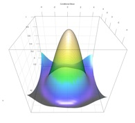

## Gallery of np/npRmpi/crs examples

Welcome!

This site is intended to provide those interested in semi- and nonparametric methods with illustrative examples using routines found in the R packages \`np\', \`npRmpi\', and \`crs\' (R is a free and open software environment for statistical computing and graphics). These packages are hosted on CRAN (the \`Comprehensive R Archive Network\') and on GitHub (a web-based hosting service). Additional information regarding these packages can be found on CRAN and on my homepage (listed below). You navigate through the gallery by clicking on the menu items above (i.e. click on the \`Primer\' menu item above for tips on getting started and so forth).

[{alt=""}](www/radial_rgl.png)

My intention here is to provide a forum for users to share code and discover examples and illustrations in addition to the examples and illustrations found in the R help files for the various functions contained in these packages (so perhaps start there first). For a listing of functions and descriptions see the \`Function index\' menu item above.

Information on installing R can be found at the \`R/RStudio\' menu item above, and a gentle guide to getting started can be found at the \`Primer\' menu item above. 

Feedback is most welcome and encouraged, particularly refinements, typos, bug reports and so forth, though you might first consult the FAQ (\`Frequently Asked Questions\') for each package before emailing me in case your query has already been addressed (here are links to the FAQs: [np_faq.pdf](https://cran.r-project.org/web/packages/np/vignettes/np_faq.pdf "https://cran.r-project.org/web/packages/np/vignettes/np_faq.pdf"), [crs_faq.pdf](https://cran.r-project.org/web/packages/crs/vignettes/crs_faq.pdf "https://cran.r-project.org/web/packages/crs/vignettes/crs_faq.pdf")). 

You can contact me via email at [racinej\@mcmaster.ca](mailto:racinej@mcmaster.ca?subject=email%20subject "mailto:racinej@mcmaster.ca?subject=email subject"). And, of course, feel free to forward your commented examples and I will post them along with your contact information.

Additional resources (solutions manuals, code to accompany books, monographs, etc.) can be found at <a href="https://jeffreyracine.github.io/research">jeffreyracine.github.io/research</a>.

Jeffrey S. Racine  
Department of Economics  
McMaster University  
Hamilton, Ontario, Canada  
[experts.mcmaster.ca/display/racinej](https://experts.mcmaster.ca/display/racinej "https://experts.mcmaster.ca/display/racinej")
