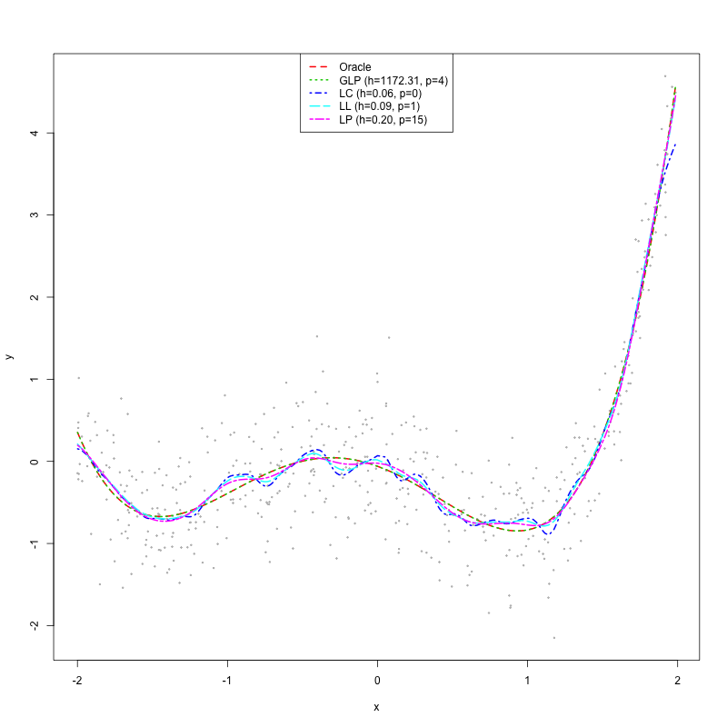

This page is meant to give you working code that you can copy directly. The longer scripts are still linked below, but the first goal is to let you run something useful without downloading a bundle of files.

{.hero-image}

## A first regression example

This mirrors the spirit of `regression_intro_a.R` in a shorter form.

```r
library(np)
data(cps71, package = "np")

plot(cps71$age, cps71$logwage, cex = 0.25, col = "grey")

fit_lc <- npreg(logwage ~ age, data = cps71)
fit_ll <- npreg(logwage ~ age, data = cps71, regtype = "ll")

lines(cps71$age, fitted(fit_lc), col = 1, lty = 1)
lines(cps71$age, fitted(fit_ll), col = 2, lty = 2)

legend(
  "topleft",
  c("Local constant", "Local linear"),
  lty = c(1, 2),
  col = c(1, 2),
  bty = "n"
)
```

## A small bandwidth-selection example

```r
library(np)

set.seed(42)
n <- 1000
x <- runif(n)
z1 <- rbinom(n, 1, 0.5)
z2 <- rbinom(n, 1, 0.5)
y <- cos(2 * pi * x) + z1 + rnorm(n, sd = 0.25)
z1 <- factor(z1)
z2 <- factor(z2)
mydat <- data.frame(y, x, z1, z2)

bw <- npregbw(y ~ x + z1 + z2, regtype = "ll", bwmethod = "cv.aic", data = mydat)
fit <- npreg(bws = bw, data = mydat)

summary(bw)
summary(fit)
```

## Script library

- Simple univariate local constant and local linear regression: [regression_intro_a.R](www/Regression/regression_intro_a.R)
- Derivative estimation: [regression_intro_b.R](www/Regression/regression_intro_b.R)
- Plotting fitted objects and intervals: [regression_intro_c.R](www/Regression/regression_intro_c.R)
- Multivariate regression: [regression_multivar_a.R](www/Regression/regression_multivar_a.R)
- Generalized local polynomial comparison: [demo_poly.R](www/Regression/demo_poly.R)

For a website-first route to the multivariate example, see [Multivariate Regression and Prediction](multivariate_regression.qmd).

## Notes

- The script links remain useful because they are more heavily commented than the short code blocks on this page.
- Some examples call for additional packages. Where that is the case, the script itself says so.
- `demo_poly.R` requires `crs` because it calls `npglpreg()`.
- The `wage1` multivariate route now has its own page at [Multivariate Regression and Prediction](multivariate_regression.qmd).
- For plotting objects, gradients, and uncertainty summaries, see [Plotting and Intervals](plotting_and_intervals.qmd).
