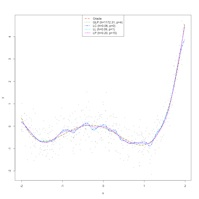

Kernel regression examples using np

Below you will find a range of commented examples intended to help you become familiar with applied nonparametric kernel regression in R/RStudio using the np package. You ought to be able to copy and paste these examples into the R/RStudio console and run them without modification. Or you can save the scripts and then open them in RStudio by navigating the menus File -\> Open File after which you can click the \`Source' 

[{alt=""}](www/Regression/demo_poly_all.png)

icon which will run the code.

Note that my code always begins with the line \`rm(list=ls())' which just uses the unix syntax \`rm' to \`remove' stuff from memory if it exists (ensures a clean replicable run) and \`list=ls()' says to remove everything (\`ls' is the unix syntax for listing things). Also, I have tried to add comments to describe important features being demonstrated (it is probably good practice to liberally comment your code). Sometimes I create plots to illustrate some feature of an estimated model. Furthermore, you can break a line of code onto multiple lines - this is optional but for me it helps keep the code tidy and legible. Kindly note you must install the np package in order to run these examples.

1.  Introduction to simple univariate local constant and local linear regression and plotting ([regression_intro_a.R](www/Regression/regression_intro_a.R "Regression_files/regression_intro_a.R"))

2.  Introduction to simple univariate local constant and local linear regression and derivative estimation ([regression_intro_b.R](www/Regression/regression_intro_b.R "Regression_files/regression_intro_b.R"))

3.  Introduction to plotting objects via \`plot(foo,\...)', where foo is a nonparametric object ([regression_intro_c.R](www/Regression/regression_intro_c.R "Regression_files/regression_intro_c.R")), adding error bounds (asymptotic and bootstrap) and so forth

4.  Introduction to multivariate regression ([regression_multivar_a.R](www/Regression/regression_multivar_a.R "Regression_files/regression_multivar_a.R"))

5.  Comparison of univariate kernel regression estimators - local constant, local linear, and infinite-order local polynomial ([demo_poly.R](www/Regression/demo_poly.R "Regression_files/demo_poly.R")) which creates the figure displayed above (note that this requires that you first install the crs package in order to call the function npglpreg() that conducts the infinite-order/generalized local polynomial estimation)

 

 

 
